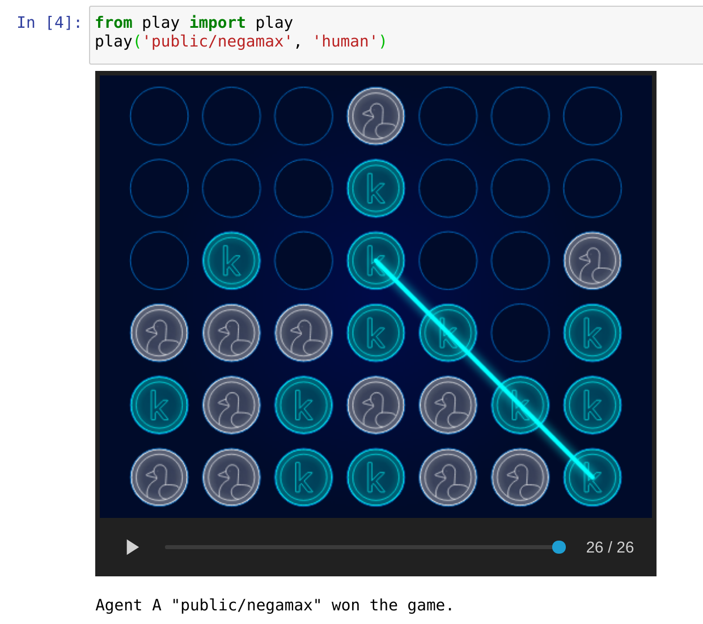

kaggle-connectx
================

Infrastructure to build agents for *Kaggle* competition *ConnectX.*

Environment setup
-----------------

.. sourcecode:: bash

   ~ $ pip install -r requirements.txt

Quick start
-----------

.. sourcecode:: bash

   ~ $ jupyter notebook play.ipynb

- To watch computer agents play against themselves, change the agent name `human` to another agent name, such as ``random``, ``simple`` or ``public/negamax``, etc.
- File names inside ``/agent`` are agent names.

To play inside terminal instead of Jupyter notebook, use:

.. sourcecode:: bash

   ~ $ ./play.py public/negamax human

More options:

.. sourcecode:: bash

   ~ $ ./play.py --help

Run game performance benchmarks
-------------------------------

Run 1v1 benchmark of ``simple`` agent against a ``random`` agent:

.. sourcecode:: bash

   ~ $ ./benchmark.py simple --enemy_name random

Run benchmark vs all other agents:

.. sourcecode:: bash

   ~ $ ./benchmark.py simple

More options:

.. sourcecode:: bash

   ~ $ ./benchmark.py --help

Run tests
---------

.. sourcecode:: bash

   ~ $ pytest

Upload agent
------------

To upload `agents/simple.py` agent:

1. Commit all changes made to the repository, and merge to the `master` branch
2. Run:

.. sourcecode:: bash

   ~ $ ./upload.sh simple

Note, there's a limit of 2 submissions per 24 hours.

Notes
-----
The board size and winning condition may change in the future. Add an `assert` at the top of an agent function if the agent is depending on the conditions. For example, to play only in games with the default configuration, use:

.. sourcecode:: python

   assert (configuration.columns == 7
           and configuration.rows == 6
           and configuration.inarow == 4
           and configuration.timeout >= 5)

